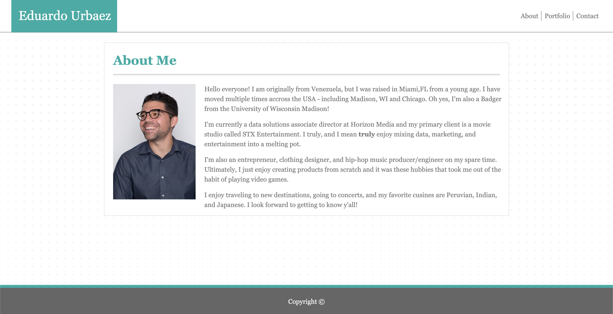
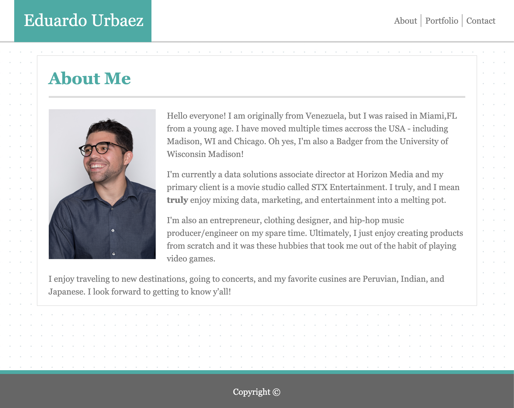
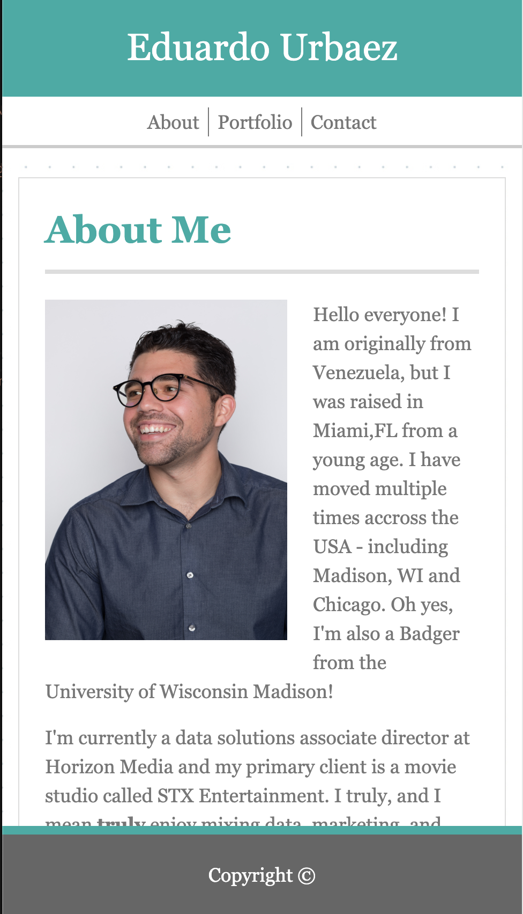
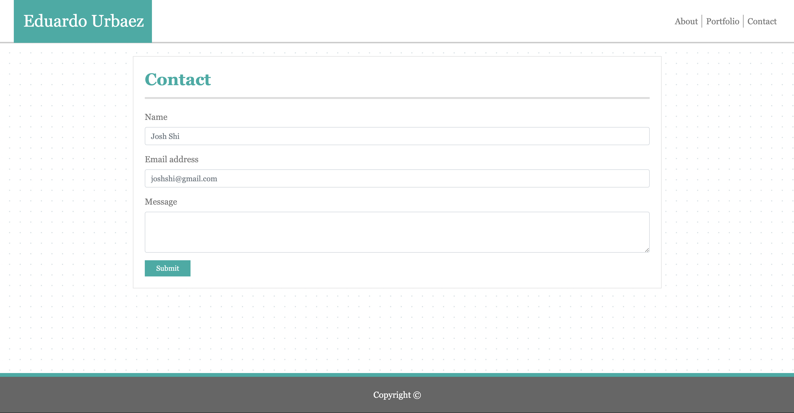
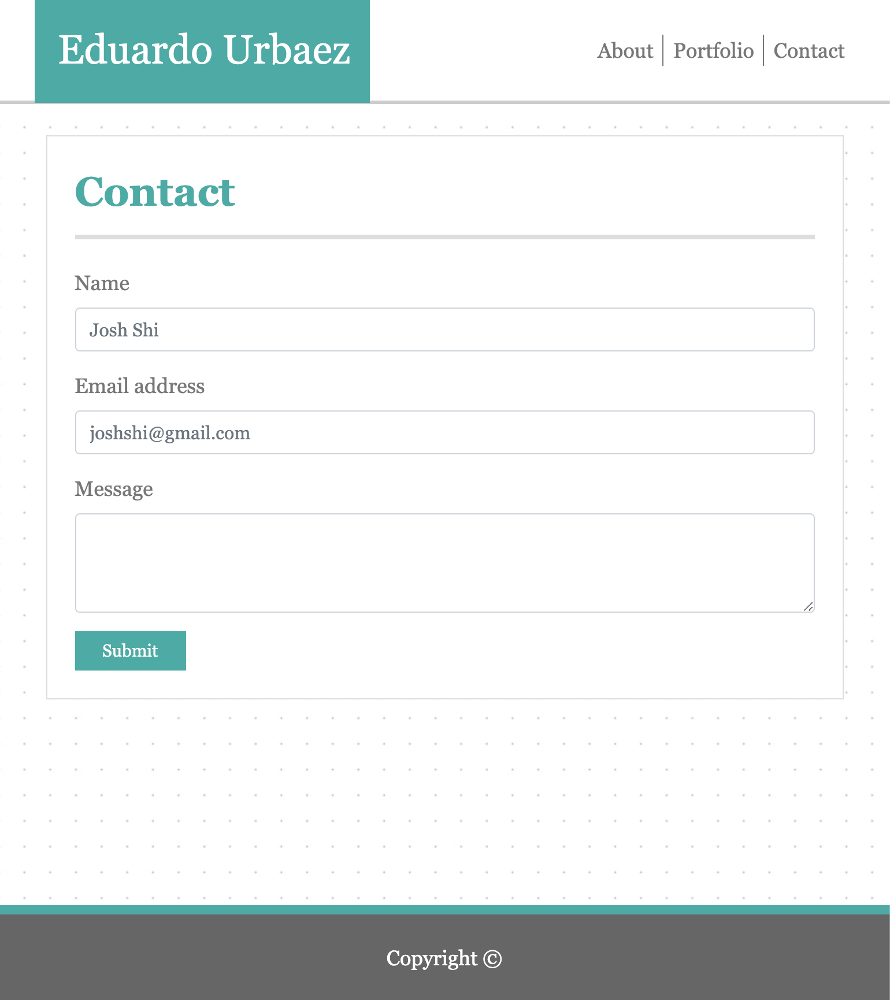
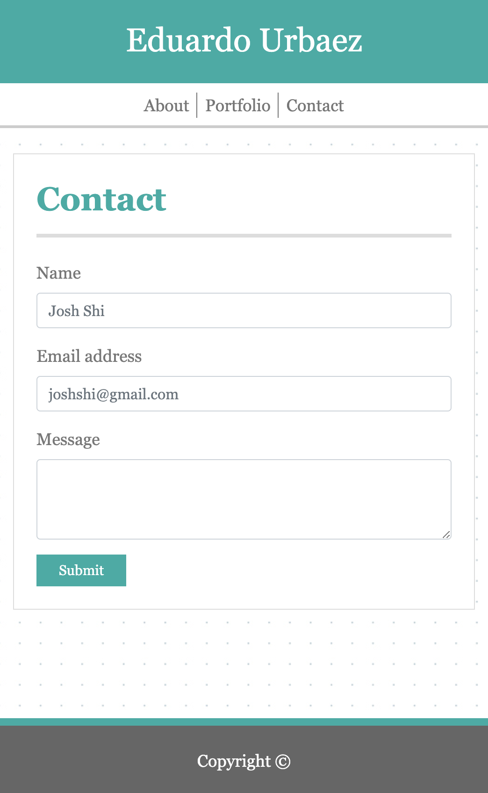
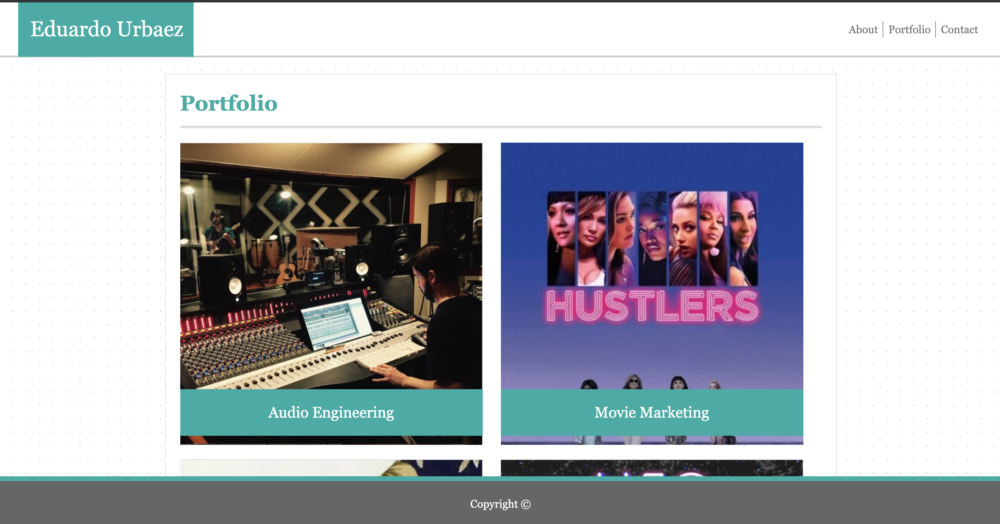
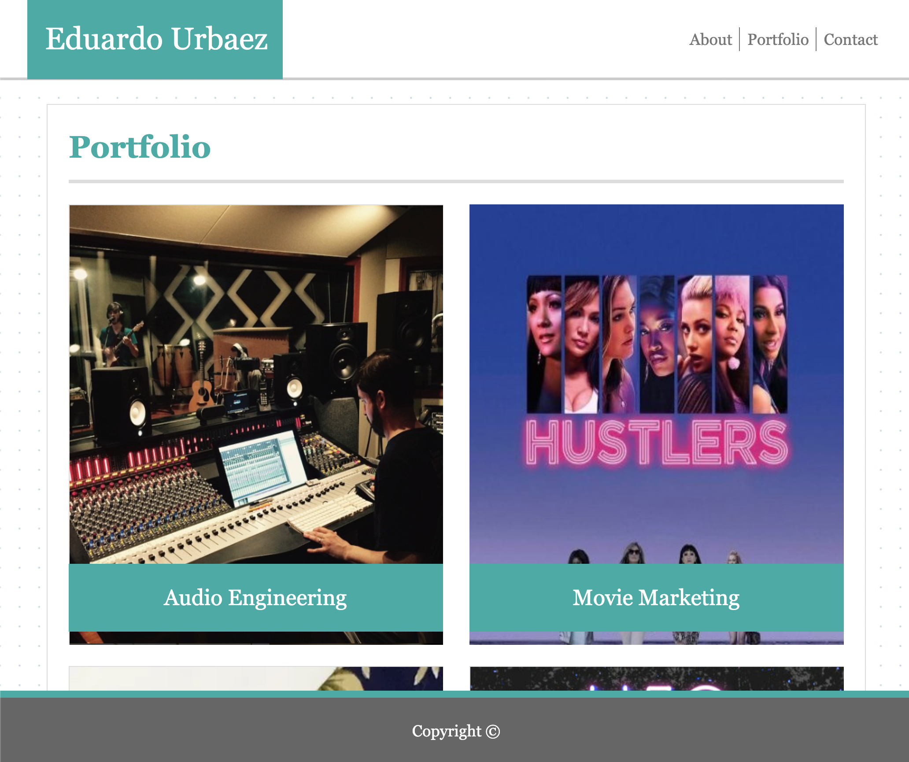
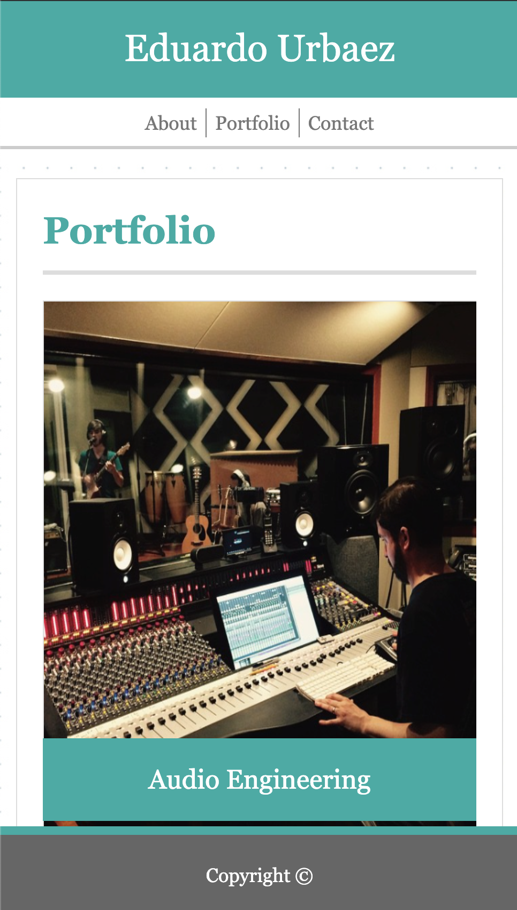

# home-work-2

Submission repository for second website/homework. 

All students were tasked with completing a fully responsive website using bootstrap's css library. 

Starting with the about me page, below are three different examples of the responsive page in action. 

As for the contact page, the responsive design had to include a form using bootstrap.

Lastly, the Portfolio page had a more complicated setup using the bootstrap columns within a container. In addition, in order to retain the flow of this page - I had to include an invisible image to help maintain the intended column brakeout dimensions for the fith image. 

Please let me know if you have any questions. 

Thanks,
Eduardo Urbaez
